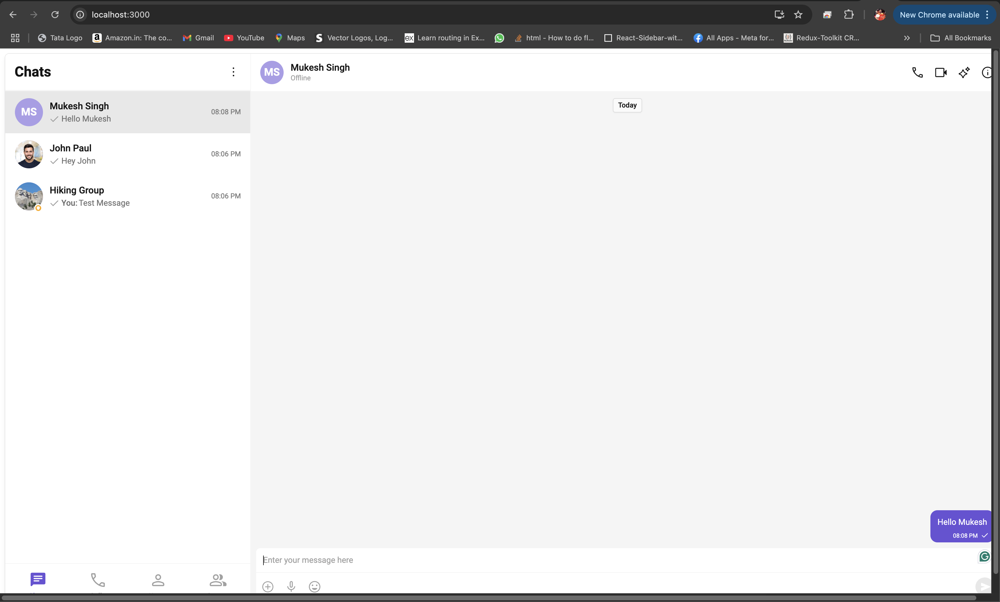
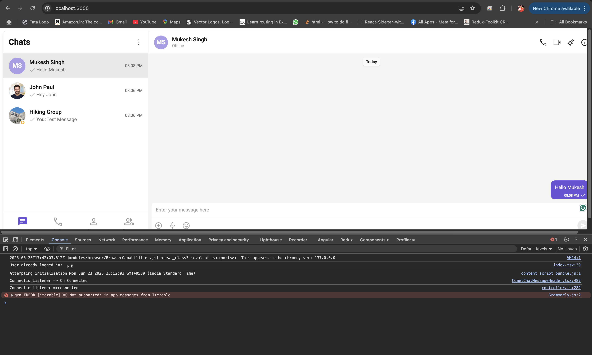
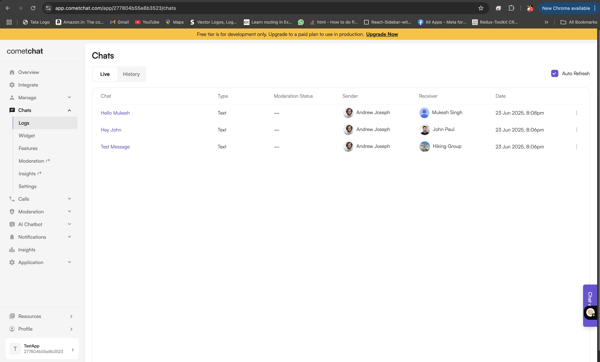

# 💬 CometChat Integration – React + TypeScript

This project demonstrates the integration of **CometChat React UI Kit** in a modern **React + TypeScript** application, with secure configuration, auto-login, and full-featured chat UI.

---

## 🚀 Features

- 🔧 React + TypeScript (CRA)
- 📦 Integrated with `@cometchat/chat-uikit-react`
- 🔐 Environment-based configuration
- ✅ Auto-login using UID
- 📱 Fully responsive CometChat UI

---

## 📁 Project Structure

```structure
cometchat-ts-react-ui/
├── src/
│ ├── App.tsx
│ ├── index.tsx
│ ├── components/
│ │ └── CometChatApp.tsx
│ ├── constants/
│ │ └── cometchatConstants.ts
│ ├── CometChat/
│ │ └── (UI Kit files if needed)
│ └── .env

```

---

## 🔐 Environment Variables

Create a `.env` file in the root:

```env
REACT_APP_COMETCHAT_APP_ID=your-app-id
REACT_APP_COMETCHAT_REGION=your-region
REACT_APP_COMETCHAT_AUTH_KEY=your-auth-key
REACT_APP_COMETCHAT_UID=your-test-user-id
```
📝 Replace values with your credentials from https://app.cometchat.com

1. Clone the repo
   
```clone
git clone https://github.com/Dex44/cometchat-ts-react-ui.git
cd cometchat-ts-react-ui
```

2. Install dependencies
   
```install
npm install
```

3. Add .env file (see above)

4. Start development server
   
```start
npm start
```

💡 How It Works
index.tsx initializes CometChat using UIKitSettingsBuilder

Logs in test user from .env (REACT_APP_COMETCHAT_UID)

Renders full <CometChatUI /> in App.tsx using a CometChatProvider

## 🛠️ Issues Faced During Implementation

- Initially, the project was set up using **React with JavaScript**, while the CometChat UI Kit documentation and examples were designed for **TypeScript**.
- This caused compatibility issues and confusion during setup and usage of typed components from the UI Kit.

## ✅ How I Resolved It

- I created a **new React project using TypeScript** with the CRA TypeScript template.
- Reinstalled all required dependencies (`@cometchat/chat-uikit-react`) and followed the documented steps carefully for TypeScript integration.
- After aligning with the documentation, the CometChat UI Kit was successfully integrated.


## 📸 Screenshots

### ✅ CometChat UI Rendered



---

### ✅ Successful Login Console



---

### ✅ CometChat Dashboard Log


